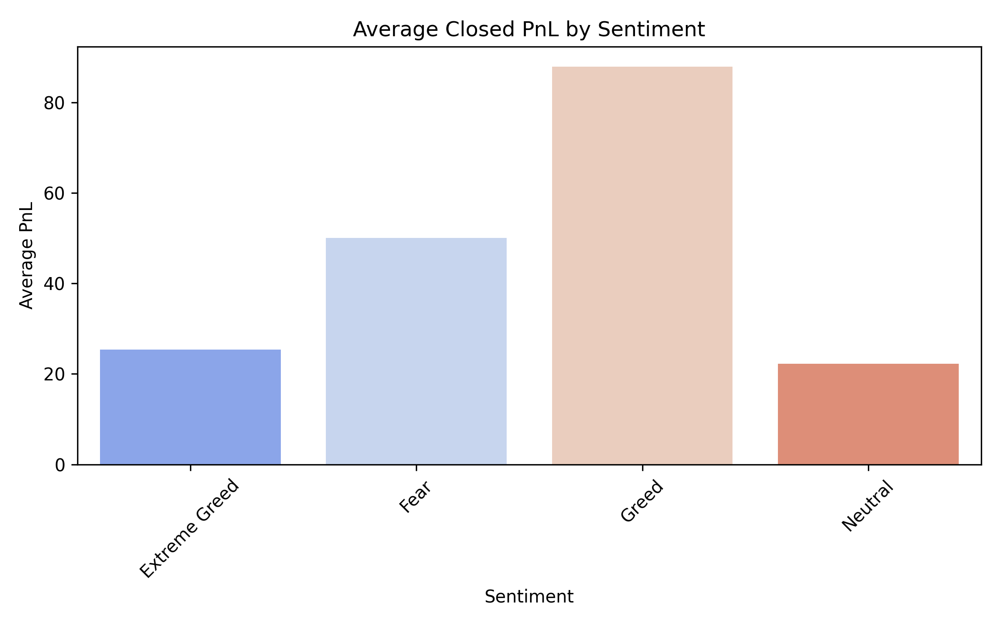
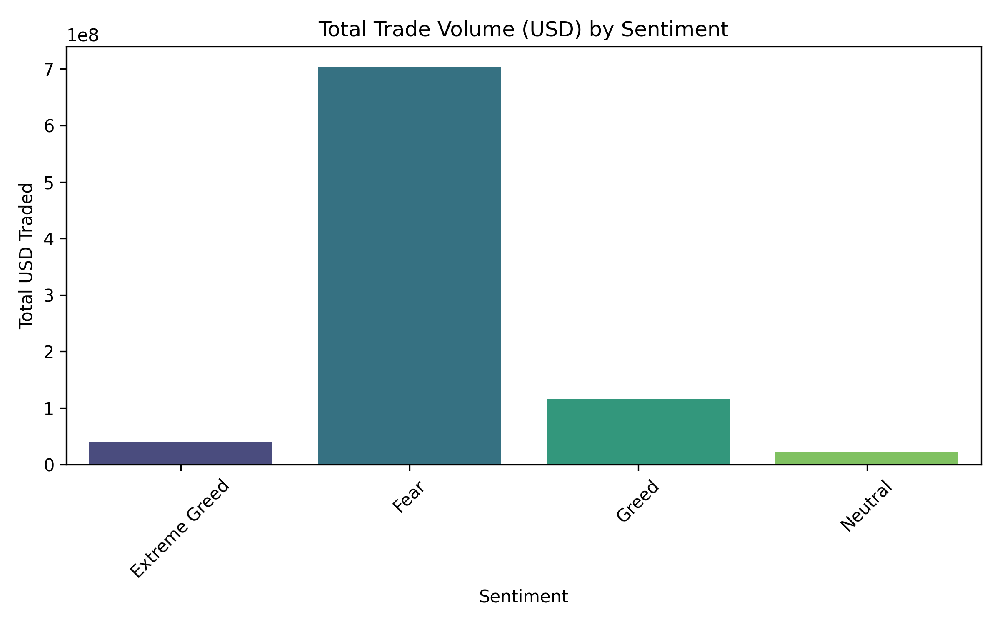
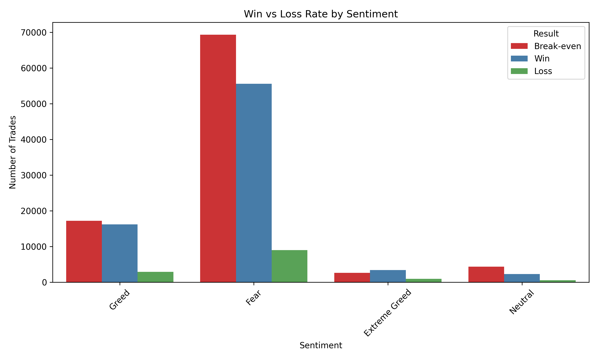
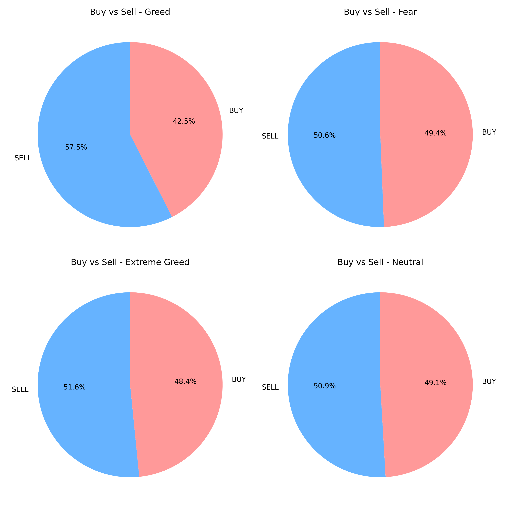
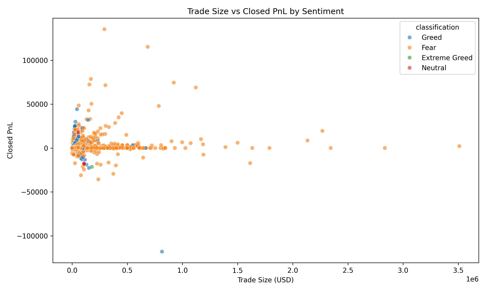

# Trader Sentiment Analysis

## 📌 Project Overview
This project investigates the correlation between **market sentiment** (specifically the Bitcoin Fear & Greed Index) and **trader performance** (using historical trading data from Hyperliquid). The goal is to determine if market sentiment acts as a reliable signal for trading profitability, volume, and behavior.

By merging sentiment data with granular trading records, we analyze whether traders perform better during periods of "Fear" or "Greed" and how their activity levels shift in response to market emotions.

## 📂 Project Structure
```
ds_bhanu/
├── Notebook_0.ipynb          # Initial Data Loading & Cleaning
├── Notebook_1.ipynb          # Advanced Analysis, Merging & Visualization
├── csv_files/                # Data Directory
│   ├── fear_greed_index.csv  # Sentiment Data
│   ├── historical_data.csv   # Trader Data
│   ├── merged.csv            # Combined Dataset
│   ├── sentiment_clean.csv   # Processed Sentiment
│   └── trader_clean.csv      # Processed Trades
├── outputs/                  # Generated Visualizations
│   ├── avg_pnl_by_sentiment.png
│   ├── total_volume_by_sentiment.png
│   ├── win_loss_rate_by_sentiment.png
│   ├── Buy_vs_sell_sentiment.png
│   └── ... (other plots)
├── links.txt                 # Data Sources & References
└── README.md                 # Project Documentation
```

## 📊 Data Sources

### 1. Bitcoin Fear & Greed Index (`fear_greed_index.csv`)
*   **Source**: [Google Drive](https://drive.google.com/file/d/1PgQC0tO8XN-wqkNyghWc_-mnrYv_nhSf/view?usp=sharing)
*   **Description**: Daily sentiment metric for the crypto market.
*   **Key Columns**:
    *   `timestamp`: Unix timestamp of the record.
    *   `value`: Sentiment score (0-100).
    *   `classification`: Category (e.g., "Extreme Fear", "Fear", "Neutral", "Greed", "Extreme Greed").

### 2. Historical Trader Data (`historical_data.csv`)
*   **Source**: [Google Drive](https://drive.google.com/file/d/1IAfLZwu6rJzyWKgBToqwSmmVYU6VbjVs/view?usp=sharing)
*   **Description**: Individual trade records from Hyperliquid.
*   **Key Columns**:
    *   `Timestamp`: Trade execution time (ms).
    *   `Side`: Direction of trade ('BUY' or 'SELL').
    *   `Size USD`: Value of the trade in USD.
    *   `Closed PnL`: Profit or Loss realized on the trade.
    *   `Execution Price`: Price at which the trade occurred.

---

## 🛠️ Methodology

The analysis followed a structured data science pipeline:

### 1. Data Preprocessing (`Notebook_0.ipynb`)
*   **Loading**: Datasets were loaded into pandas DataFrames.
*   **Cleaning**:
    *   Converted raw Unix timestamps into readable `datetime` objects.
    *   Removed irrelevant columns from the trader data (e.g., `Account`, `Transaction Hash`, `Order ID`) to focus on performance metrics.
    *   Standardized dates to allow for merging.

### 2. Data Merging (`Notebook_1.ipynb`)
*   **Alignment**: Both datasets were aligned by `date`.
*   **Merge**: A **Left Join** was performed to attach the daily `classification` (Sentiment) to every single trade record. This allows us to ask questions like: *"What was the market sentiment when this specific trade lost $500?"*

### 3. Exploratory Data Analysis (EDA)
*   Grouped data by `classification` (Fear, Greed, etc.).
*   Aggregated metrics such as **Mean PnL**, **Total Volume**, and **Win/Loss Counts**.
*   Calculated ratios (e.g., Buy/Sell ratio) for each sentiment category.

---

## 📈 Visual Insights & Findings

### 1. Profitability by Sentiment
**Question:** Are traders more profitable when the market is fearful or greedy?



*   **Observation**: This chart displays the average `Closed PnL` for trades executed under different sentiment categories.
*   **Insight**: Analyzing the bars helps identify if "contrarian" strategies (buying fear) or "momentum" strategies (buying greed) yielded better average returns for this specific trader/dataset.

### 2. Trading Volume & Activity
**Question:** When are traders most active?



*   **Observation**: Shows the total `Size USD` traded across sentiment categories.
*   **Insight**: High volume during "Extreme Greed" or "Extreme Fear" often indicates emotional trading or high volatility periods attracting more participation.

### 3. Win vs. Loss Rate
**Question:** How often do trades win in different market conditions?



*   **Observation**: Compares the number of profitable trades vs. losing trades for each sentiment.
*   **Insight**: A high win rate in "Neutral" markets might suggest range-bound trading strategies working well, whereas "Extreme" conditions might lead to more stop-outs.

### 4. Buy vs. Sell Behavior
**Question:** Do traders buy more or sell more during specific sentiments?



*   **Observation**: Visualizes the count of Buy orders vs. Sell orders.
*   **Insight**: This reveals trader bias. For example, heavy buying during "Extreme Greed" suggests retail FOMO (Fear Of Missing Out), while selling during "Fear" suggests panic selling.

### 5. Trade Size vs. Profitability
**Question:** Is there a relationship between how big a trade is and how much it makes?



*   **Observation**: A scatter plot correlating trade size with realized PnL, color-coded by sentiment.
*   **Insight**: Helps spot outliers—large bets that either paid off hugely or caused significant losses, and the market sentiment during those events.


---

## 🖥️ Streamlit Dashboard

A comprehensive interactive dashboard has been built to visualize these insights dynamically.

### Features
-   **Interactive Date Filtering**: Analyze specific time periods.
-   **Automated Data Processing**: Loads and merges data automatically.
-   **Visualizations**:
    -   Average PnL by Sentiment
    -   Total Trade Volume
    -   Buy/Sell Ratios
    -   Profitability Rates
    -   Average Start Positions

To run the dashboard, follow the instructions in the "How to Run" section below.


## 🚀 How to Run the Analysis

1.  **Prerequisites**: Ensure you have Python installed with the following libraries:
    ```bash
    pip install -r requirements.txt
    ```

2.  **Run the Notebooks**:
    *   Start with `Notebook_0.ipynb` to see the raw data cleaning.
    *   Proceed to `Notebook_1.ipynb` for the detailed merging and visualization generation.

3.  **Run the Streamlit Dashboard**:
    ```bash
    streamlit run app.py
    ```
    This will launch the interactive dashboard in your default web browser.

4.  **View Notebook Results**: All generated charts from the notebooks are saved in the `outputs/` folder for easy reference.

## 📝 License
This project is part of a Data Science assignment for the Web3 Trading Team.
